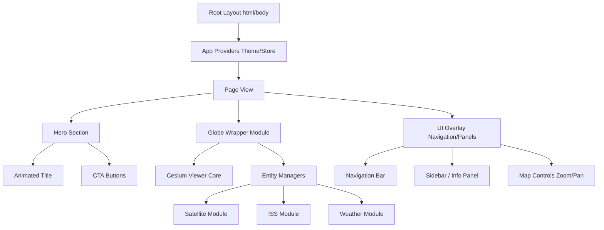

# Project Zenith Component Hierarchy

```mermaid
graph TD
    RootLayout[Root Layout html/body]
    Providers[App Providers Theme/Store]
    RootLayout --> Providers
    Providers --> Page[Page View]
    
    Page --> Hero[Hero Section]
    Page --> GlobeWrapper[Globe Wrapper Module]
    Page --> UIOverlay[UI Overlay Navigation/Panels]
    
    Hero --> Title[Animated Title]
    Hero --> CTAButtons[CTA Buttons]
    
    GlobeWrapper --> CesiumViewer[Cesium Viewer Core]
    GlobeWrapper --> EntityManagers[Entity Managers]
    
    EntityManagers --> SatelliteModule[Satellite Module]
    EntityManagers --> ISSModule[ISS Module]
    EntityManagers --> WeatherModule[Weather Module]
    
    UIOverlay --> Navbar[Navigation Bar]
    UIOverlay --> Sidebar[Sidebar / Info Panel]
    UIOverlay --> Controls[Map Controls Zoom/Pan]
```
