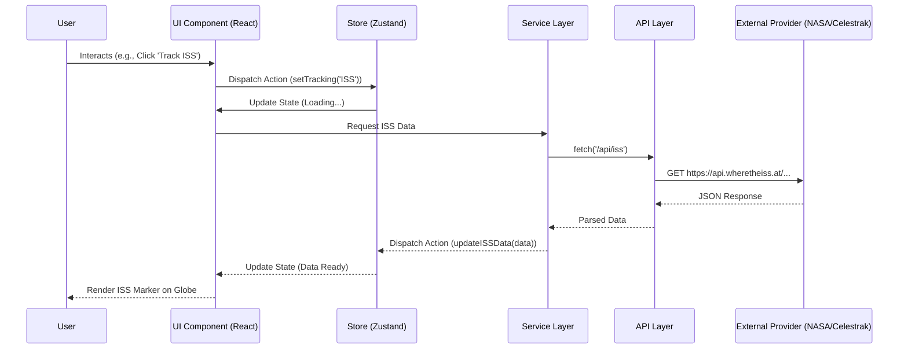

# Zenith Data Flow Diagram

```mermaid
sequenceDiagram
    participant User
    participant UI as UI Component (React)
    participant Store as Store (Zustand)
    participant Service as Service Layer
    participant API as API Layer
    participant Provider as External Provider (NASA/Celestrak)

    User->>UI: Interacts (e.g., Click 'Track ISS')
    UI->>Store: Dispatch Action (setTracking('ISS'))
    Store->>UI: Update State (Loading...)
    UI->>Service: Request ISS Data
    Service->>API: fetch('/api/iss')
    API->>Provider: GET https://api.wheretheiss.at/...
    Provider-->>API: JSON Response
    API-->>Service: Parsed Data
    Service-->>Store: Dispatch Action (updateISSData(data))
    Store-->>UI: Update State (Data Ready)
    UI-->>User: Render ISS Marker on Globe
```
